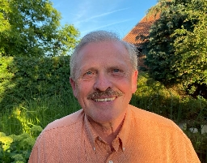

# Willkommen

Wir heißen Sie im Namen der Einwohner:innen von Rössing herzlich willkommen auf dieser
Internetseite. Auf den Folgenden Seiten finden Sie die Online-Version der
Bewerbung des Dorfes Rössing für den Regional- und Landesentscheid des
Wettbewerbs "Unser Dorf hat Zukunft". Diese Internetseite wurde aus Folgenden
Gründen erstellt:

- Sie soll den Jury-Mitgliedern eine bequeme und angenehme Möglichkeit bieten,
  die Bewerbungsinhalte zu studieren. Durch die moderne Darstellung, welche auch
  für mobile Endgeräte optimiert ist, sollte dies in digitaler Form gut möglich
  sein.
- Wir haben alle redaktionellen Inhalte unter der
  [Creative Commons CC-0 Lizenz](https://creativecommons.org/publicdomain/zero/1.0/deed.de)
  veröffentlicht. So wird es auch zukünftigen Generationen möglich sein, die von
  uns erstellten Inhalte für weitere, wichtige Arbeiten für unser Dorf und
  darüber hinaus wiederzuverwenden. Der gesamte Quellcode dieser Internetseite
  ist frei einsehbar und verwertbar.

Wir hoffen, dass Ihnen diese Art der Darstellung zusagt und freuen uns bereits
jetzt auf den Besuch der Jury in Rössing im Mai 2025.  

Bis dahin grüßen Sie
herzlichst

<Columns>
  <Column>
      
    **Dr. Udo Noack** für die Bürgerstiftung Rössing und
  </Column>
  <Column>
    
  **Wolfgang Scholz** als Ortsbürgermeister von
    Rössing.
  </Column>
</Columns>

